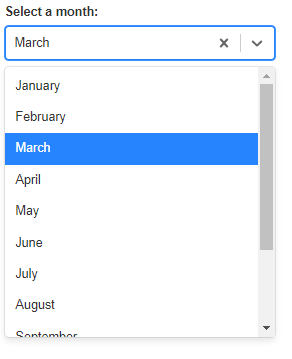

# shinyReactWidgets

> [ReactR](https://github.com/react-R/reactR) Widgets for Shiny apps

## Installation

You can install from GitHub:

``` r
# you need branch 'input-binding' from ReactR
remotes::install_github("react-R/reactR@input-binding")

remotes::install_github("pvictor/shinyReactWidgets")
```

## react-select

Widget for [react-select](https://github.com/JedWatson/react-select)



``` r
library(shiny)
library(shinyReactWidgets)

ui <- fluidPage(
  tags$h1("react-select example"),

  select_input(
    inputId = "select",
    choices = month.name,
    multi = FALSE
  ),

  verbatimTextOutput("res")
)

server <- function(input, output, session) {

  output$res <- renderPrint({
    input$select
  })

}

shinyApp(ui, server)
```

